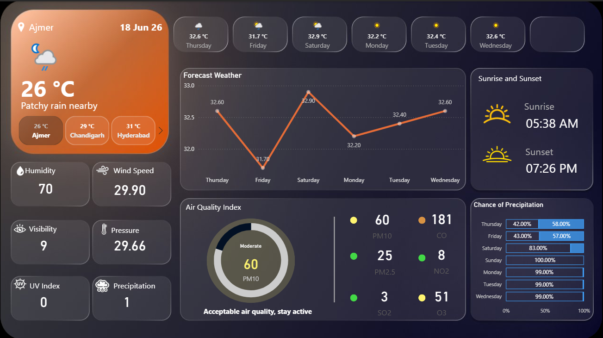

# Power BI Weather & Air Quality Analytics Dashboard 🌦️

## Overview

This project showcases an interactive Power BI dashboard designed to analyze weather conditions, temperature trends, air quality metrics, and environmental patterns.

The dashboard provides a comprehensive view of current weather conditions, forecast trends, AQI levels, pollutant analysis, and precipitation probability through visually engaging and interactive data visualizations.

## Tools Used

- Power BI
- Power Query
- DAX (Data Analysis Expressions)
- Data Visualization
- Weather & Environmental Data Analysis

## Dashboard Features

- Real-time weather overview with temperature and weather conditions
- Weekly temperature forecast analysis
- Air Quality Index (AQI) monitoring
- Pollutant level analysis:
  - PM10
  - PM2.5
  - CO
  - NO₂
  - SO₂
  - O₃
- Sunrise and sunset tracking
- Humidity, wind speed, visibility, pressure, UV index, and precipitation analysis
- Interactive dashboard layout with data-driven insights

## Dashboard Preview

## Key Learnings

- Data cleaning and transformation using Power Query
- Creating meaningful KPIs and visualizations in Power BI
- Developing interactive dashboards using slicers and filters
- Working with environmental datasets
- Creating insights through data storytelling and visualization

## Project Outcome

Built an intuitive weather analytics dashboard that transforms raw environmental data into meaningful insights, helping users understand weather patterns and air quality trends effectively.
